# UCAS-LinearCircuitExperiment

## Intro

中国科学院大学 "线性电子线路实验" 课程的实验报告（用 LaTex 撰写），仓库内容包括 .pdf 实验报告、.tex 源文件、原始实验数据/图片、MATLAB 源码等。

下面是实验报告的部分截图：

<!-- 
 (2nd edition, 2014) Chapter 5.png>)
assets/image-1.png
https://github.com/YiDingg/UCAS-LinearCircuitExperiment/blob/af6c47bc8d2376e2acb8c3e5d6067fa2c38753fb/assets/image-1.png
-->

## LCE-01 二极管
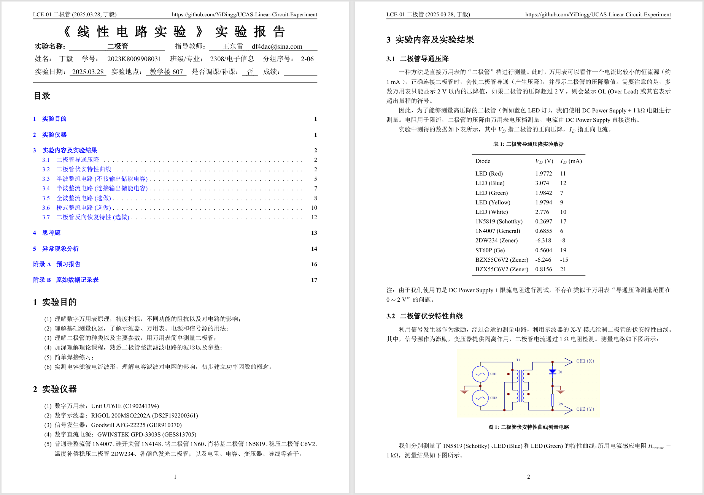

## LCE-02 三极管
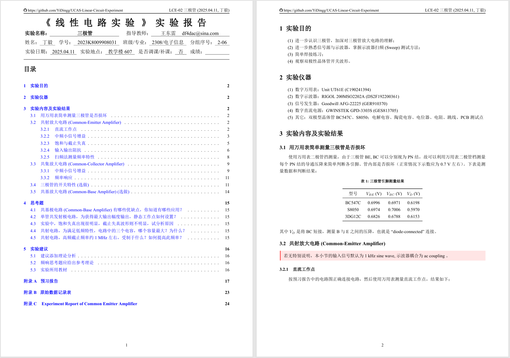
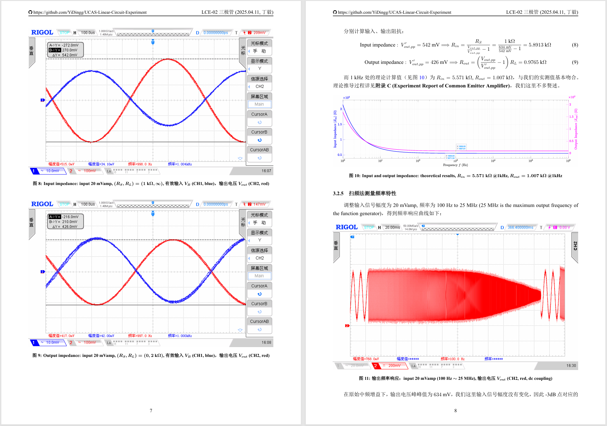
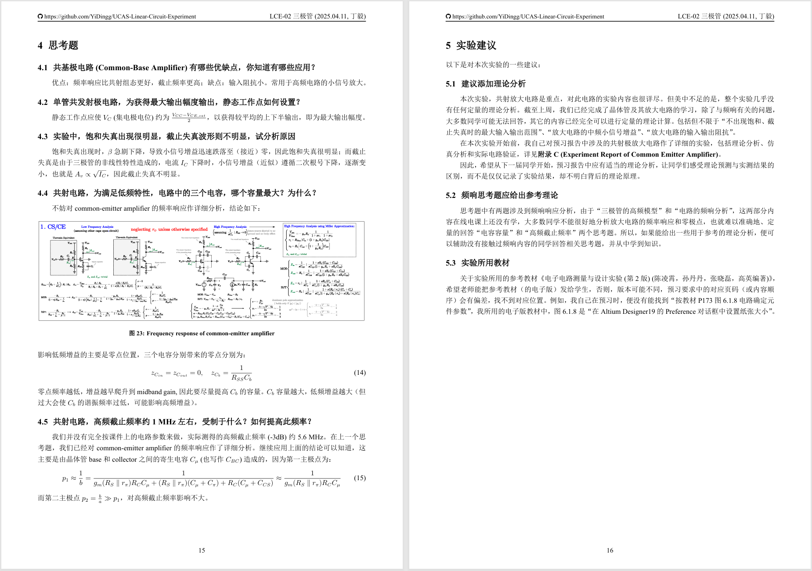

## LCE-03 功率放大器
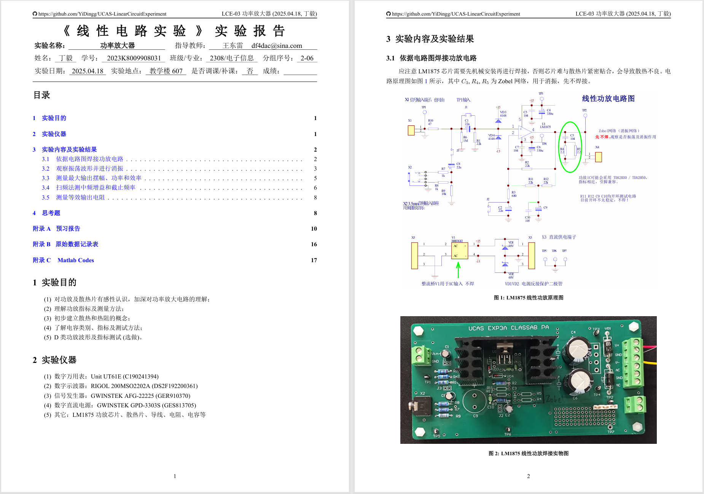
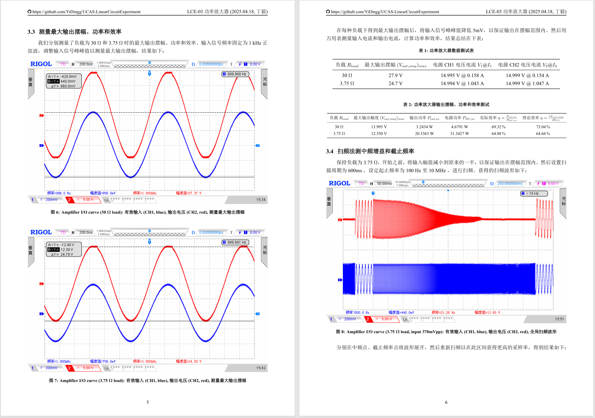
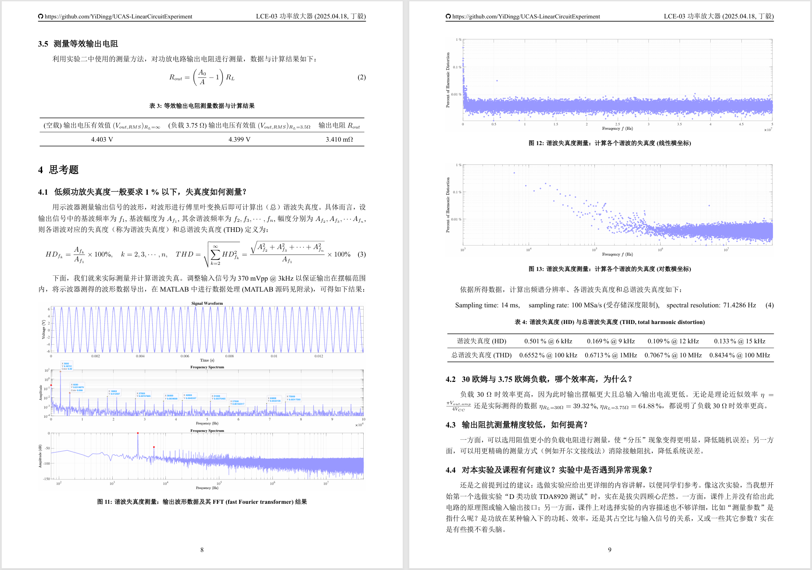

## LCE-04 场效应管
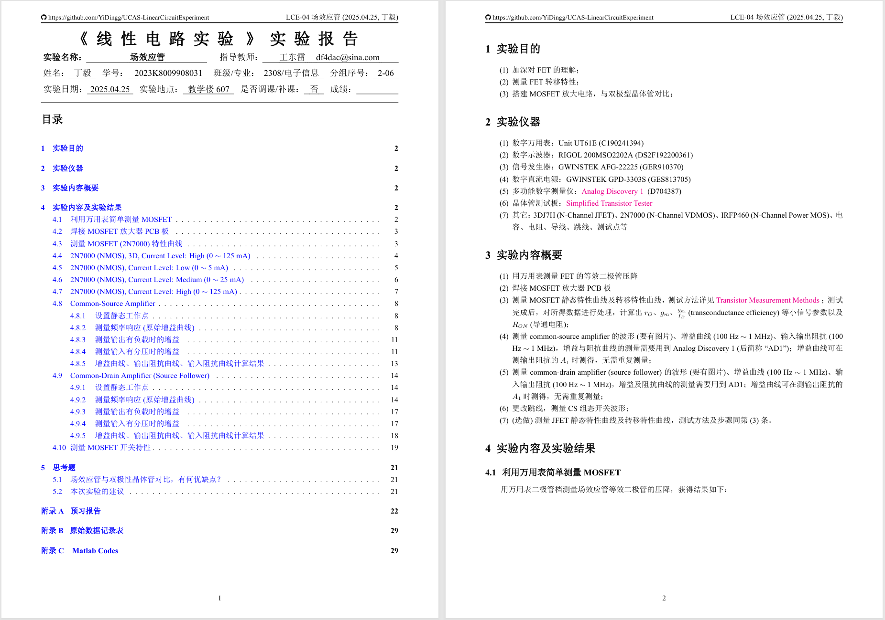
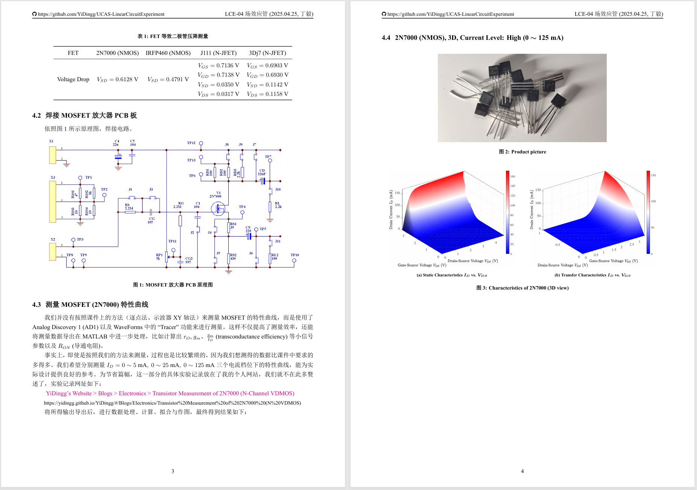
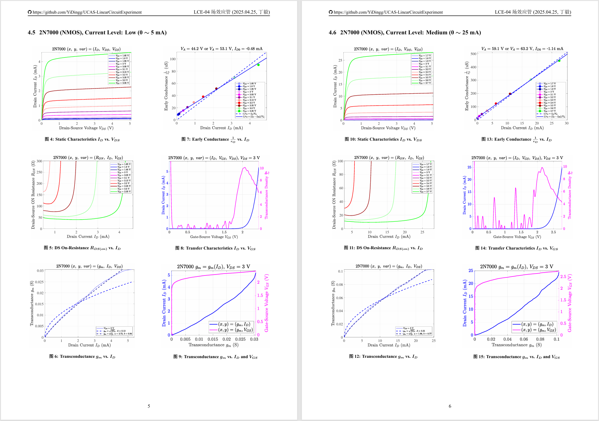
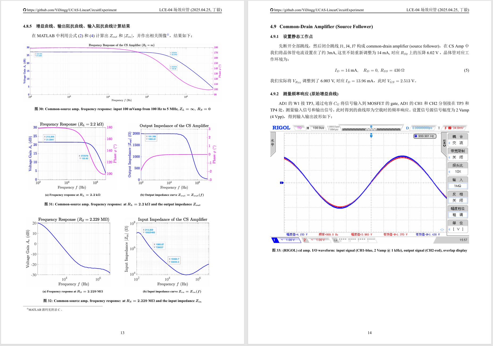
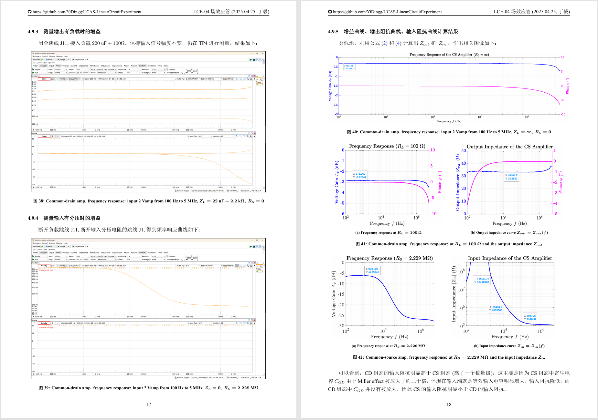
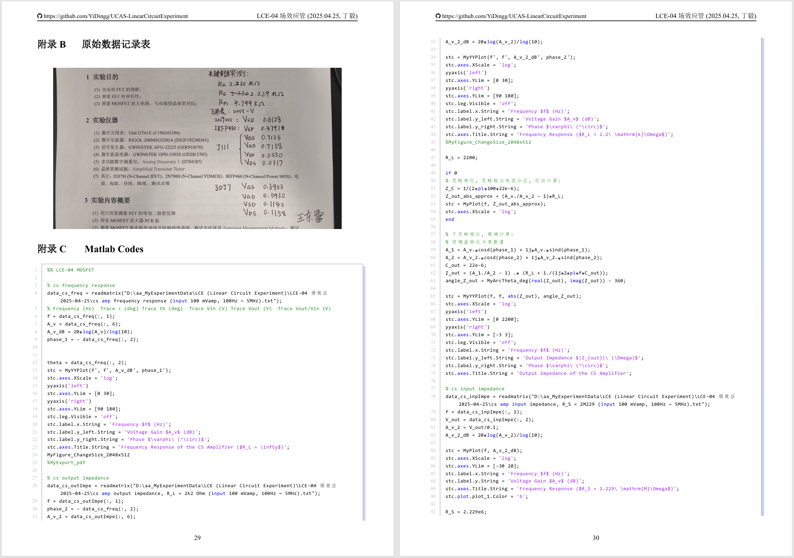